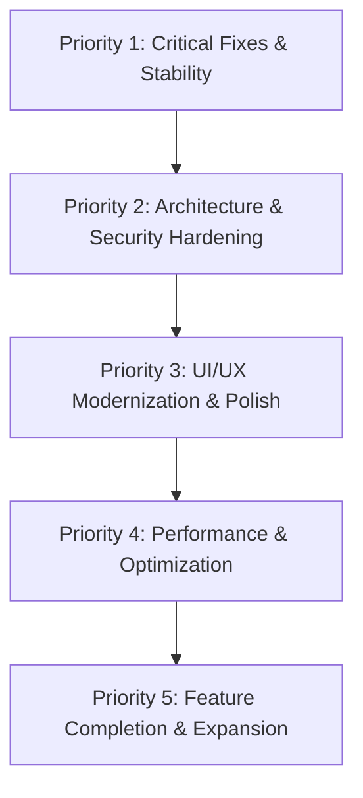

# Comprehensive Codebase & Architecture Audit: Full-Stack Ecommerce

**Date:** September 7, 2026  
**Auditor:** Antigravity Senior Pair Programmer  
**Repository:** `c:\Users\moham\OneDrive\Desktop\Ecommerce`  
**Backend:** Django 5.2.4 + DRF 3.18.0 + MySQL 8.x + PyMySQL + SimpleJWT  
**Frontend:** React 19.2.8 + Vite 8.2.2 + TypeScript 6.0.2 + TailwindCSS v4.3.3 + TanStack Query v5.102 + Zustand v5.0.15  

---

## 1. Executive Summary & Current Phase

### Current Project Phase: **Phase 2 Complete / Phase 3 Partial / Phase 4 Scaffolded (Broken)**

A detailed analysis of documentation files (`PHASE_0_DOCS.md` through `PHASE_4_PLAN.md`), database tables, backend endpoints, and frontend source code reveals the true status:

- **Phase 0 (Environment & Tooling):** **Completed with Warnings**. MySQL 8.x is active on port 3307; Python virtual environment is functional; Vite frontend runs on port 5174. However, `npm run build` is failing due to TypeScript 6 deprecation (`TS5101: Option 'baseUrl' is deprecated`), and `requirements.txt` has missing dependencies (`django-cors-headers`, `django-filter`).
- **Phase 1 (Data Models & Database Schema):** **Completed with Flaws**. Core models exist (`Category`, `Product`, `ProductImage`, `Cart`, `CartItem`, `Order`, `OrderItem`, `Review`, `Coupon`, `Payment`, `UserProfile`). However, critical ecommerce schema requirements like an **Address Book** model are missing, and database indexes on query-intensive fields are absent.
- **Phase 2 (DRF REST APIs & Django Admin):** **Completed with Flaws**. ViewSets, serializers, and JWT authentication exist, but suffer from serious N+1 database queries, security vulnerabilities (unauthenticated coupon listing, non-owner order modification), missing development media serving, and lack of inventory management.
- **Phase 3 (Frontend Authentication & Protected Routes):** **Partially Completed (Buggy)**. Login, registration, and JWT token storage in Zustand are present. However, token refresh fails (the backend endpoint is missing from `urls.py`), logout crashes in `Profile.tsx`, and public storefront pages (`/`, `/products`, `/products/:id`) were mistakenly wrapped in `ProtectedRoute`, locking unauthenticated users out of browsing the store.
- **Phase 4 (Storefront UI & User Experience):** **Scaffolded Only (Non-Functional / Mock UI)**. Page components exist for Home, Products, Product Detail, Cart, Checkout, Order Confirmation, Profile, and Admin Dashboard, but contain critical bugs:
  - Cart and Checkout render `$NaN` for prices and blank product names due to mismatched serializer keys.
  - Review queries point to non-existent API routes (`404`).
  - Product listing renders all products in a single vertical stack due to broken grid wrappers.
  - Profile and Admin Dashboard actions (saving profile, adding products/categories/coupons, updating order status) are unhandled mock UI.
  - Zustand `cartStore.ts` is orphaned and completely disconnected from the application.
  - `AppLayout` and `Footer` are never rendered.

---

## 2. Working Features

The following features have been verified to function correctly in isolation:

1. **Database & ORM Connectivity:** Django connects to MySQL 8.x (`ecommerce_db` on `127.0.0.1:3307`) via `pymysql.install_as_MySQLdb()`. All initial migrations are applied.
2. **User Registration & Login (API & UI):**
   - `POST /api/auth/register/` creates a Django user and linked `UserProfile`, returning JWT access and refresh tokens.
   - `POST /api/auth/login/` authenticates credentials and returns JWT tokens and user payload.
   - Frontend `LoginForm` and `RegisterForm` properly trigger TanStack Query mutations and write tokens to persistent storage.
   - Password reveal/hide eye toggle works interactively on both auth forms.
3. **Product Catalog & Category Read APIs:**
   - `GET /api/products/` returns paginated products with image lists and category details.
   - `GET /api/categories/` returns paginated categories with product counts.
   - `GET /api/products/<id>/` returns detailed single product data.
4. **Interactive Form Validation (Frontend):**
   - Zod / React Hook Form validates empty or malformed inputs on Login and Register, preventing invalid submissions and presenting error messages.
5. **Django Admin Interface:**
   - Standard models (`User`, `Category`, `Product`, `Order`, `Coupon`, `Review`, `Payment`) are registered in Django admin with image thumbnail previews for products and inline displays.

---

## 3. Missing Features (Against Existing Requirements)

The final application requires features that either do not exist or remain non-functional stubs:

| Required Feature | Current Status | Description of Gap |
| :--- | :--- | :--- |
| **Address Book** | ❌ Missing | No `Address` model exists. `UserProfile` only contains a single flat address set. Customers cannot save multiple shipping or billing addresses. |
| **Guest / Anonymous Browsing** | ❌ Blocked | `App.tsx` wraps `/`, `/products`, and `/products/:id` in `<ProtectedRoute>`, forcibly redirecting any casual visitor to `/login`. |
| **Product Multi-Image Upload (Admin UI)** | ❌ Missing | No frontend image upload handling for multi-image gallery management in Admin Dashboard. |
| **Dynamic Category Navigation** | ❌ Missing | `Home.tsx` and `Products.tsx` render hardcoded category strings (`electronics`, `fashion`, etc.) rather than reading categories from the database API. |
| **Backend Price & Rating Filtering** | ❌ Missing | `ProductViewSet` filterset only lists `['category', 'is_active', 'is_featured']`. `min_price`, `max_price`, and `rating` query parameters sent by the frontend are ignored by the backend. |
| **Stock Deduction on Checkout** | ❌ Missing | When an order is created from the cart, `Product.stock` is never decremented, allowing infinite over-ordering. |
| **Stock Replenishment on Order Cancel** | ❌ Missing | Cancelling an order updates status to `cancelled` but performs no stock adjustment. |
| **Coupon Usage Tracking & Enforcement** | ❌ Missing | `Coupon` model has `usage_limit` and `usage_limit_per_user`, but there is no `used_count` and no user-coupon tracking table (`CouponUsage`). Limits are unenforced. |
| **Customer Review Submission** | ❌ Non-Functional | Review mutation sends `{ product: id }` instead of `{ product_id: id }`, and query calls `/products/<id>/reviews/` which does not exist in the backend. |
| **Profile & Settings Management** | ❌ Non-Functional | "Save Changes" on `Profile.tsx` has no submit handler; `UserSerializer` marks `profile` as read-only on the backend. |
| **Admin Operations Dashboard** | ❌ Stub Only | Buttons to add products, add categories, create coupons, and update order statuses have no event handlers or API mutations. |
| **Global Footer** | ❌ Missing | `components/layout/Footer.tsx` exists as a completed component but is never imported or rendered in `App.tsx`. |
| **Wishlist** | ❌ Missing | Mentioned in requirements; no backend model, serializer, or frontend component has been implemented. |

---

## 4. Bugs Discovered (Detailed Breakdown)

### High & Critical Severity Bugs

#### Bug 1: Media Files Not Served in Development
- **File:** [`backend/backend/urls.py`](file:///c:/Users/moham/OneDrive/Desktop/Ecommerce/backend/backend/urls.py)
- **Root Cause:** `urlpatterns` lacks `static(settings.MEDIA_URL, document_root=settings.MEDIA_ROOT)`.
- **Impact:** Any uploaded product image, category icon, or user avatar stored in `media/` returns a `404 Not Found` when requested by the browser.

#### Bug 2: Missing Token Refresh Endpoint on Backend
- **File:** [`backend/accounts/urls.py`](file:///c:/Users/moham/OneDrive/Desktop/Ecommerce/backend/accounts/urls.py) vs [`frontend/src/utils/api.ts:69`](file:///c:/Users/moham/OneDrive/Desktop/Ecommerce/frontend/src/utils/api.ts#L69)
- **Root Cause:** `frontend/src/utils/api.ts` makes a POST request to `http://localhost:8000/api/auth/refresh/` on 401 intercept. However, `backend/accounts/urls.py` only defines `register/`, `login/`, and `profile/`. It fails to include `TokenRefreshView.as_view()`.
- **Impact:** Once an access token expires (60 minutes), the automatic refresh fails with a `404`, wiping local credentials and kicking active users back to the login screen.

#### Bug 3: Profile Updates Ignored Due to Read-Only Nested Serializer
- **File:** [`backend/accounts/serializers.py:11`](file:///c:/Users/moham/OneDrive/Desktop/Ecommerce/backend/accounts/serializers.py#L11) & [`backend/accounts/views.py:46`](file:///c:/Users/moham/OneDrive/Desktop/Ecommerce/backend/accounts/views.py#L46)
- **Root Cause:** `UserProfileView` uses `UserSerializer`. In `UserSerializer`, `profile = UserProfileSerializer(read_only=True)`. There is no custom `update()` method on `UserSerializer` to persist changes to the related `UserProfile` fields.
- **Impact:** Any PUT/PATCH request to `/api/auth/profile/` with `phone_number`, `address`, `city`, etc., is discarded; only user table fields (`first_name`, `last_name`) update.

#### Bug 4: Public Storefront Routes Locked Behind Authentication
- **File:** [`frontend/src/App.tsx:50-53`](file:///c:/Users/moham/OneDrive/Desktop/Ecommerce/frontend/src/App.tsx#L50-L53)
- **Root Cause:** `<Route path="/" element={<ProtectedRoute><HomePage /></ProtectedRoute>} />`, along with `/products` and `/products/:id`, are wrapped in `<ProtectedRoute>`.
- **Impact:** Any first-time or guest visitor opening the site is immediately redirected to `/login`, destroying the standard ecommerce browsing funnel.

#### Bug 5: Cart Items Render `$NaN` Prices and Empty Product Names
- **Files:** [`frontend/src/pages/Cart.tsx:118-128`](file:///c:/Users/moham/OneDrive/Desktop/Ecommerce/frontend/src/pages/Cart.tsx#L118-L128) & [`frontend/src/pages/Checkout.tsx:388-396`](file:///c:/Users/moham/OneDrive/Desktop/Ecommerce/frontend/src/pages/Checkout.tsx#L388-L396)
- **Root Cause:** `CartItemSerializer` in DRF outputs `{ id, product: { ... }, product_id, quantity, total_price }`. The frontend code attempts to read `item.product_name` and `item.unit_price`.
- **Impact:** `item.product_name` evaluates to `undefined` (blank display), and `parseFloat(item.unit_price).toFixed(2)` yields `$NaN each` on all cart line items.

#### Bug 6: Review API URL and Payload Mismatch
- **Files:** [`frontend/src/api/storeApi.ts:303, 312`](file:///c:/Users/moham/OneDrive/Desktop/Ecommerce/frontend/src/api/storeApi.ts#L303) vs [`backend/reviews/views.py`](file:///c:/Users/moham/OneDrive/Desktop/Ecommerce/backend/reviews/views.py)
- **Root Cause:**
  1. `useProductReviews` queries `/products/${productId}/reviews/`. The backend reviews router is mounted at `/api/reviews/` and filters by query param `?product=${productId}`. The requested route returns `404`.
  2. `useCreateReview` posts `{ product: productId, ... }`, but `ReviewSerializer` requires `{ product_id: productId, ... }`. DRF rejects the payload with a `400 Bad Request`.
- **Impact:** Customer reviews cannot be fetched or submitted on product pages.

#### Bug 7: Category API Pagination Breaks Frontend Array Methods
- **Files:** [`backend/backend/settings.py:168`](file:///c:/Users/moham/OneDrive/Desktop/Ecommerce/backend/backend/settings.py#L168) & [`frontend/src/api/storeApi.ts:130`](file:///c:/Users/moham/OneDrive/Desktop/Ecommerce/frontend/src/api/storeApi.ts#L130)
- **Root Cause:** DRF has global pagination enabled (`PageNumberPagination`, page size 20). `/api/categories/` returns `{ count: 1, next: null, previous: null, results: [...] }`. `useCategories` types and returns the response as `Category[]`.
- **Impact:** Calling `.map()` on `categories` (such as in `AdminDashboard.tsx`) triggers `TypeError: categories.map is not a function`.

#### Bug 8: Admin Route Redirects All Staff/Superusers to Home
- **Files:** [`frontend/src/components/ProtectedRoute.tsx:28`](file:///c:/Users/moham/OneDrive/Desktop/Ecommerce/frontend/src/components/ProtectedRoute.tsx#L28) vs [`backend/accounts/serializers.py:15`](file:///c:/Users/moham/OneDrive/Desktop/Ecommerce/backend/accounts/serializers.py#L15)
- **Root Cause:** `ProtectedRoute` checks `if (requireAdmin && user && !user.is_staff)`. However, `UserSerializer` on the backend does not expose `is_staff` in its fields list, and `User` interface in `authStore.ts` does not have `is_staff`.
- **Impact:** `user.is_staff` is always `undefined`. The condition `!undefined` evaluates to `true`, preventing all administrators from accessing `/admin/*`.

#### Bug 9: Broken Logout Trigger in Profile Component
- **File:** [`frontend/src/pages/Profile.tsx:10, 21`](file:///c:/Users/moham/OneDrive/Desktop/Ecommerce/frontend/src/pages/Profile.tsx#L10)
- **Root Cause:** `ProfilePage` destructured `const { user, logout } = useAuthStore()`. `useAuthStore` defines `clearAuth`, not `logout`.
- **Impact:** Clicking "Logout" inside the profile view calls `logout()`, resulting in `TypeError: logout is not a function` and an unhandled UI crash.

#### Bug 10: `npm run build` Fails Due to Deprecated `baseUrl`
- **File:** [`frontend/tsconfig.app.json:26`](file:///c:/Users/moham/OneDrive/Desktop/Ecommerce/frontend/tsconfig.app.json)
- **Root Cause:** TypeScript 6.0+ flags `baseUrl` as deprecated with `TS5101: Option 'baseUrl' is deprecated and will stop functioning in TypeScript 7.0`. Because `npm run build` executes `tsc -b && vite build`, compilation halts immediately.
- **Impact:** Production bundling fails completely.

#### Bug 11: Single Column Product Grid Bug
- **File:** [`frontend/src/pages/Products.tsx:272-284`](file:///c:/Users/moham/OneDrive/Desktop/Ecommerce/frontend/src/pages/Products.tsx#L272-L284)
- **Root Cause:** The parent element defines `
`, but only contains a single child: `<ProductGrid ... />`. Inside `ProductGrid`, items are wrapped in `
`.
- **Impact:** Rather than rendering products across a 4-column responsive grid, all products are crammed into column 1 in a single vertical list.

#### Bug 12: Dual Pagination Controls Rendered Simultaneously
- **File:** [`frontend/src/pages/Products.tsx:287-307, 340-361`](file:///c:/Users/moham/OneDrive/Desktop/Ecommerce/frontend/src/pages/Products.tsx#L287)
- **Root Cause:** Pagination controls are rendered both in the main `ProductListing` page body and duplicated inside the nested `ProductGrid` function.
- **Impact:** Distorted page layout with redundant pagination bars.

---

## 5. Code Quality & Architecture Issues

### Duplication & Dead Code
1. **Duplicated `ProductCard` Component:**
   - Exists at [`components/common/ProductCard.tsx`](file:///c:/Users/moham/OneDrive/Desktop/Ecommerce/frontend/src/components/common/ProductCard.tsx).
   - Re-declared from scratch as an inline function in [`pages/Home.tsx:184`](file:///c:/Users/moham/OneDrive/Desktop/Ecommerce/frontend/src/pages/Home.tsx#L184).
2. **Duplicated `ProductGrid` Component:**
   - Exists at [`components/products/ProductGrid.tsx`](file:///c:/Users/moham/OneDrive/Desktop/Ecommerce/frontend/src/components/products/ProductGrid.tsx).
   - Re-declared from scratch as an inline function in [`pages/Products.tsx:313`](file:///c:/Users/moham/OneDrive/Desktop/Ecommerce/frontend/src/pages/Products.tsx#L313).
3. **Dead Zustand Store (`cartStore.ts`):**
   - [`stores/cartStore.ts`](file:///c:/Users/moham/OneDrive/Desktop/Ecommerce/frontend/src/stores/cartStore.ts) is 109 lines of custom client-side cart logic with localStorage persistence.
   - Grep verification confirms it is **imported 0 times**. All pages instead use TanStack Query (`useCart` in `storeApi.ts`), leaving `cartStore` completely abandoned.
4. **Orphaned Layout & Footer:**
   - [`components/layout/AppLayout.tsx`](file:///c:/Users/moham/OneDrive/Desktop/Ecommerce/frontend/src/components/layout/AppLayout.tsx) and [`components/layout/Footer.tsx`](file:///c:/Users/moham/OneDrive/Desktop/Ecommerce/frontend/src/components/layout/Footer.tsx) are fully implemented but never rendered in `App.tsx`.
5. **Redundant JSX Attributes:**
   - [`pages/Home.tsx:53, 62`](file:///c:/Users/moham/OneDrive/Desktop/Ecommerce/frontend/src/pages/Home.tsx#L53): Button attributes specify `size="lg"` twice.
   - [`pages/Home.tsx:168, 170`](file:///c:/Users/moham/OneDrive/Desktop/Ecommerce/frontend/src/pages/Home.tsx#L168): Input element specifies `placeholder="Enter your email"` twice.

### Architecture Smells & Anti-Patterns
1. **Hardcoded Base URLs in API Layer:**
   - [`frontend/src/utils/api.ts:5, 69`](file:///c:/Users/moham/OneDrive/Desktop/Ecommerce/frontend/src/utils/api.ts#L5) hardcodes `http://localhost:8000/api` instead of utilizing `import.meta.env.VITE_API_URL`.
2. **Heavy Use of `any` Types:**
   - `ProductCard`, `ProductGrid`, `OrderConfirmation`, `Cart`, and `AdminDashboard` discard TypeScript safety by declaring props and mapped data as `any` (e.g., `product: any`, `order: any`, `item: any`), despite strongly-typed interfaces existing in `storeApi.ts`.
3. **State Mutation During Render Effects:**
   - [`pages/Products.tsx:53-75`](file:///c:/Users/moham/OneDrive/Desktop/Ecommerce/frontend/src/pages/Products.tsx#L53) contains chained `useEffect` calls that synchronize query params with internal state, creating unnecessary re-renders and React hook warnings.
4. **Tailwind Version Conflict:**
   - `frontend/src/index.css` uses Tailwind v3 syntax (`@tailwind base; @tailwind components; @tailwind utilities;`), while `frontend/src/styles/globals.css` uses Tailwind v4 `@import "tailwindcss"; @theme { ... }`.
   - Both stylesheets are loaded simultaneously in `main.tsx` and `App.tsx`, causing PostCSS CSS token clashes and breakpoint malfunctions (`md:hidden` failing).

---

## 6. Performance Audit

### Backend Query Inefficiencies (N+1 Queries)
1. **`CategorySerializer.get_product_count`:**
   - Lines 12-13 of `products/serializers.py`: `return obj.products.count()`.
   - For a list of 20 categories, this executes 1 query for the categories plus 20 independent `COUNT(*)` queries.
   - **Remedy:** Annotate the queryset in `CategoryViewSet` with `.annotate(product_count=Count('products'))`.
2. **`ProductViewSet` Queryset:**
   - Line 25 of `products/views.py`: `queryset = Product.objects.all()`.
   - Lacks `select_related('category')` and `prefetch_related('images')`.
   - Serializing a page of 20 products triggers 1 base query + 20 queries for categories + 20 subqueries for category product counts + 20 queries for product images = **61 queries per page load**.
   - **Remedy:** Apply `queryset = Product.objects.select_related('category').prefetch_related('images')`.
3. **`OrderViewSet` & `ReviewViewSet`:**
   - `Order.objects.all()` lacks `select_related('user', 'coupon')` and `prefetch_related('items__product')`.
   - `Review.objects.all()` lacks `select_related('user', 'product')`.

### Missing Database Indexes
- Frequently filtered and sorted columns in MySQL currently have no indexes:
  - `Product`: `price`, `is_active`, `is_featured`, `created_at`.
  - `Order`: `order_status`, `payment_status`, `created_at`.
  - `Coupon`: `code`, `is_active`, `valid_from`, `valid_to`.

### Frontend Bundle & Render Bottlenecks
- **No Dynamic Route Splitting:** All 10 page components are imported statically at the top of `App.tsx`, forcing the initial client bundle to 673 kB (minified).
- **Missing Memoization:** `ProductCard` and price calculations are re-rendered on every state update without `React.memo` or `useMemo`.
- **Unoptimized Images:** Product images are rendered via unconstrained `` tags without `loading="lazy"` or `srcset`.

---

## 7. Security Audit

| Severity | Issue | Location | Impact / Exploitation Scenario |
| :--- | :--- | :--- | :--- |
| **CRITICAL** | **Insecure Direct Object Reference (IDOR) on Orders** | [`backend/orders/views.py:24-32`](file:///c:/Users/moham/OneDrive/Desktop/Ecommerce/backend/orders/views.py#L24) & [`backend/orders/urls.py:9-14`](file:///c:/Users/moham/OneDrive/Desktop/Ecommerce/backend/orders/urls.py#L9) | `OrderViewSet` inherits from `ModelViewSet` with `permission_classes = [IsAuthenticated]`. The custom `IsOrderOwner` permission class was declared on line 13 but **never added** to `permission_classes`. Any logged-in customer can send a `PUT`, `PATCH`, or `DELETE` request to `/api/orders/<id>/` and alter or delete any other customer's order. |
| **CRITICAL** | **Direct Order Creation Without Stock/Price Enforcement** | [`backend/orders/urls.py:5-8`](file:///c:/Users/moham/OneDrive/Desktop/Ecommerce/backend/orders/urls.py#L5) | The root path `''` of `OrderViewSet` accepts a direct `POST` to `create`. A malicious actor can post raw JSON to bypass the cart and create unpaid orders. |
| **HIGH** | **Public Exposure of All Coupon Codes & Discounts** | [`backend/coupons/views.py:22`](file:///c:/Users/moham/OneDrive/Desktop/Ecommerce/backend/coupons/views.py#L22) | `CouponViewSet` uses `IsAdminOrReadOnly`. Because `SAFE_METHODS` (GET) are permitted for anyone, any unauthenticated user can query `/api/coupons/` and view every active, hidden, and VIP promo code along with its discount percentage. |
| **HIGH** | **IDOR on Payments ViewSet** | [`backend/payments/views.py:21-24`](file:///c:/Users/moham/OneDrive/Desktop/Ecommerce/backend/payments/views.py#L21) | `PaymentViewSet` exposes full CRUD (`ModelViewSet`) to any authenticated user without object-level permission enforcement on update/destroy. |
| **MEDIUM** | **Unvalidated Decimal Conversion in Coupon Validation** | [`backend/coupons/views.py:48`](file:///c:/Users/moham/OneDrive/Desktop/Ecommerce/backend/coupons/views.py#L48) | `Decimal(str(order_amount))` does not validate input structure, causing an unhandled `decimal.InvalidOperation` exception (500 error) if non-numeric characters are supplied. |
| **MEDIUM** | **Permissive CORS in Configuration** | [`backend/backend/settings.py:217`](file:///c:/Users/moham/OneDrive/Desktop/Ecommerce/backend/backend/settings.py#L217) | `CORS_ORIGIN_ALLOW_ALL = True` is enabled. Must be replaced with explicit frontend origins for production. |

---

## 8. UI / UX Review & Modernization Opportunities

### Visual Deficiencies Observed During Browser Subagent Inspection
1. **Duplicate Header & Title Stacking:**
   - On `/login` and `/register`, the page title and description are rendered twice: once centered above the card, and again inside the card header.
2. **Broken Responsive Header:**
   - The mobile menu hamburger icon is visible on desktop monitors (1536px viewport) alongside desktop links due to conflicting Tailwind CSS rules.
3. **Static Header Cart Badge:**
   - The shopping cart badge is hardcoded to `0` in `Header.tsx` rather than reading actual items count from the user's cart.
4. **Lack of Dynamic Feedback:**
   - Adding a product to cart lacks an interactive slide-over cart drawer or animated toast counter.
5. **Incomplete Empty & Error States:**
   - Cart and wishlist lack engaging illustrations, recommended products on empty states, or clear recovery actions.
6. **Checkout Form Inconvenience:**
   - Returning authenticated users must manually re-enter their name, email, phone, and complete shipping address on every order because stored profile details are not pre-populated.

---

## 9. Prioritized Refactoring Plan

The following phased roadmap outlines the exact sequence for rectifying vulnerabilities, stabilizing architecture, and delivering a world-class storefront.

### Priority 1: Critical Fixes & Stability (Immediate)
- **1.1 Fix Development Media URL Serving:** Add `static(settings.MEDIA_URL, document_root=settings.MEDIA_ROOT)` to `backend/backend/urls.py`.
- **1.2 Add Token Refresh & Logout Endpoints:** Expose `TokenRefreshView` and custom logout blacklist view in `backend/accounts/urls.py`.
- **1.3 Fix TypeScript Build Failure:** Correct `tsconfig.app.json` by replacing or silencing deprecated `baseUrl` in compliance with TypeScript 6 standards.
- **1.4 Restore Public Browsing:** Remove `<ProtectedRoute>` wrapping from `/`, `/products`, and `/products/:id` in `frontend/src/App.tsx`.
- **1.5 Correct Cart & Checkout Field Bindings:** Update `Cart.tsx` and `Checkout.tsx` to read `item.product.name`, `item.product.price`, and images properly.
- **1.6 Resolve Reviews API Mismatch:** Update `storeApi.ts` to call `/api/reviews/?product=${id}` and send `{ product_id: id }`.
- **1.7 Fix Profile Logout Crash:** Correct `Profile.tsx` to call `clearAuth` from `useAuthStore`.
- **1.8 Fix Grid Layout on Products Page:** Restructure `Products.tsx` to render product cards directly inside the 4-column responsive grid container.

### Priority 2: Architecture & Security Hardening
- **2.1 Implement Strict Object-Level Permissions:**
  - Enforce `IsOrderOwner` on `OrderViewSet` for retrieve/update/cancel.
  - Disable raw POST `create` on `OrderViewSet` and force creation exclusively through `from_cart`.
  - Prevent non-staff users from deleting or altering order records.
- **2.2 Restrict Coupon Listing:**
  - Update `CouponViewSet` permissions so that `list` is restricted to staff (`IsAdminUser`), while `validate` remains accessible to all users.
- **2.3 Fix User Profile Serializer:**
  - Implement writable nested serializer logic in `UserSerializer.update()` to enable updating `UserProfile` fields (`phone_number`, `address`, etc.).
  - Expose `is_staff` in `UserSerializer` so frontend `ProtectedRoute` can accurately verify administrators.
- **2.4 Inventory Stock Management:**
  - Deduct `product.stock` inside `Order.from_cart` within an atomic transaction.
  - Reject order placement if `quantity > product.stock`.
  - Restore stock when an order is cancelled.
- **2.5 Consolidate Tailwind Configuration:**
  - Standardize on clean Tailwind v4 configuration, removing deprecated v3 `@tailwind` imports and ensuring breakpoint utilities (`md:flex`, `md:hidden`) work reliably.

### Priority 3: UI/UX Modernization & Polish
- **3.1 Integrate Global Layout & Footer:**
  - Wrap application routes in `AppLayout` and render `Footer.tsx` across all pages.
- **3.2 Modernize Header & Cart Badge:**
  - Connect the cart icon badge to TanStack Query cart data for real-time item count badges.
  - Fix responsive hamburger navigation behavior across all breakpoints.
- **3.3 Eliminate Duplicate Headings:**
  - Refactor `AuthLayout`, `LoginForm`, and `RegisterForm` to remove double title headers.
- **3.4 Dynamic Category & Navigation Integration:**
  - Replace hardcoded category pills with dynamic database queries from `useCategories()`.
- **3.5 Rich Aesthetics & Transitions:**
  - Implement smooth Framer Motion page transitions, product card hover micro-animations, skeleton loaders, and modern pill filter tags.

### Priority 4: Performance & Optimization
- **4.1 Eliminate ORM N+1 Queries:**
  - Optimize `ProductViewSet` with `select_related('category')` and `prefetch_related('images')`.
  - Optimize `CategoryViewSet` with `.annotate(product_count=Count('products'))`.
  - Optimize `OrderViewSet` with `select_related('user', 'coupon')` and `prefetch_related('items__product__images')`.
- **4.2 Add MySQL Indexes:**
  - Add explicit database indexes via Django migrations for `Product` (`price`, `is_active`, `is_featured`, `created_at`) and `Order` status fields.
- **4.3 Code Splitting & Lazy Loading:**
  - Apply `React.lazy()` and `<Suspense>` for all route components in `App.tsx` to reduce the initial JavaScript payload.

### Priority 5: Feature Completion & Expansion
- **5.1 Multi-Address Book:**
  - Build `Address` model (with `is_default`, `address_type`, full address fields) and expose CRUD endpoints for customers.
  - Pre-populate shipping address at checkout from saved addresses.
- **5.2 Complete Admin Dashboard:**
  - Build functional dialogs and mutations for adding products, categories, coupons, and updating order fulfillment statuses.
- **5.3 Wishlist System:**
  - Implement backend `Wishlist` model and frontend bookmarking toggles on product cards.

---

## 10. Conclusion & Next Steps

The project possesses a solid foundation with Django, MySQL, React, and Vite, but suffers from accumulated regressions, incomplete feature wiring, and security vulnerabilities left behind by the prior implementation.

**Status:** Code audit complete. **No application code has been modified.**  
**Action Required:** Awaiting user review and approval of this audit and refactoring plan before initiating Priority 1 fixes.
